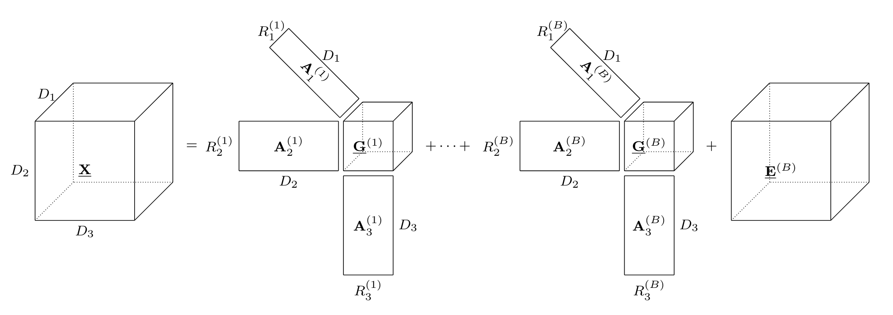

# BTTDA: Block-Term-Tensor Discriminant Analysis

Python implementation of Block-Term-Tensor Discriminant Analysis (BTTDA), a tensor classification and dimensionality reduction algorithm based on the Block-Term decomposition an Higher-Order Discriminant Analysis. BTTDA iteratively decomposes the input data in discriminant core tensors using a deflation scheme. See [arxiv.org/abs/2511.04292](https://arxiv.org/abs/2511.04292) for the main publication.
This package also provides python implementations for Higher Order Discriminant Analysis and Multi-Linear Singular Value Decomposition.



BTTDA has been applied to Brain-Computer Interfacing EEG classification problems, but can be used as a general tensor classification method for classifying other neural signals or tensors in general.

# Installation and dependencies

Install `bttda` using
```sh
pip install git+https://github.com/arnevdk/bttda.git
```

This allows you to use the implemented algorithms with CPU computation.

In some cases, tensor computations might run faster on the GPU. To enable GPU computation:

1. Install [CUDA](https://developer.nvidia.com/cuda-downloads).
2. Install [cupy](https://docs.cupy.dev/en/stable/install.html).
3. Install [cuTensor](https://developer.nvidia.com/cutensor) for more efficient GPU tensor computations.
Install the cuTensor python package for your CUDA and cupy setup according to `cupy`'s [installation instructions](https://docs.cupy.dev/en/stable/install.html) and set it as the default cupy accelerator using
```sh
export CUPY_ACCELERATORS=cutensor,cub
```
4. `bttda` uses [tensorly](https://tensorly.org/stable/index.html) as a tensor algebra backend. Ensure `tensorly` uses `cupy` as a GPU backend, set
```sh
export TENSORLY_BACKEND=cupy
```

To switch back to the CPU backend, set `TENSORLY_BACKEND=numpy`.


# Running the notebooks

You can use your current CPU/GPU setup in your python environment, install the notebook dependencies and launch jupyter using
```sh
git clone https://github.com/arnevdk/bttda.git
cd bttda
pip install .[notebooks]
jupyter notebook
```

Alternatively, we provide a containerized environment for use with podman or Docker which
sets you up for experimenting on the CPU or GPU avoiding the need to configure the `cupy` backend.
To run the notebooks with CPU computing, simply run
```sh
podman compose up bttda
```
To run with a GPU backend (NVIDIA only), first make sure the  use the
[NVIDIA Container Toolkit](https://docs.nvidia.com/datacenter/cloud-native/container-toolkit/latest/install-guide.html)
is installed and you have configured the container runtime or CDI with `nvidia-ctk`.
Next, boot up the containers with
```sh
export TENSORLY_BACKEND=cupy
podman compose up bttda
```

# Usage

# Citing
```bibtex
@misc{VanDenKerchove2025b,
	title={BTTDA: Block-Term Tensor Discriminant Analysis for Brain-Computer Interfacing},
	author={Van Den Kerchove, Arne and Si-Mohammed, Hakim and Cabestaing, François and Van Hulle, Marc M.},
	year={2025},
	eprint={2511.04292},
	archivePrefix={arXiv},
	primaryClass={eess.SP},
	url={https://arxiv.org/abs/2511.04292},
}
```

A. Van Den Kerchove, H. Si-Mohammed, F. Cabestaing, and M. M. Van Hulle, “BTTDA: Block-Term Tensor Discriminant Analysis for Brain-Computer Interfacing.” 2025. [Online]. Available: https://arxiv.org/abs/2511.04292
